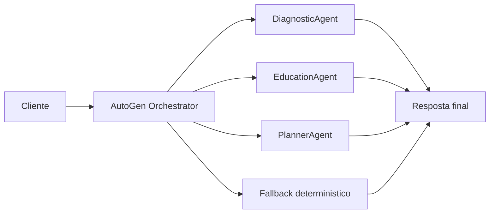

# Agente Educacao Financeira

Um MVP de `Microsoft AutoGen` para interacao educativa com clientes em cenarios de organizacao financeira pessoal. O projeto foi desenhado para demonstrar uma topologia multiagente em que diferentes papéis colaboram para interpretar o perfil financeiro, explicar prioridades, propor um plano de ação e aplicar guardrails de compliance.

## Visao Geral

O sistema responde perguntas como:

- por onde devo começar para organizar meu orçamento?
- estou muito pressionado pelo cartão?
- qual deveria ser minha prioridade nos próximos 90 dias?
- como construir reserva de emergência sem perder controle das contas?

O fluxo foi modelado com `AssistantAgent` e `RoundRobinGroupChat` do ecossistema `Microsoft AutoGen`, com um `deterministic_fallback` para manter a execução funcional no ambiente local sem dependência obrigatória de credenciais externas.

## Arquitetura



## Topologia de Execucao

O projeto foi estruturado em quatro camadas:

1. `profile layer`
   - carrega perfis financeiros demo com renda, despesas, dívidas, utilização de cartão, atrasos e objetivo financeiro;
2. `domain tools layer`
   - calcula indicadores de saúde financeira, prioridades e plano de ação;
3. `agent orchestration layer`
   - usa `Microsoft AutoGen` para coordenar agentes especializados quando o runtime está disponível;
4. `presentation layer`
   - expõe o fluxo via `CLI` e `Streamlit`.

Essa separação deixa o MVP auditável e reduz o risco de respostas soltas sem base no perfil consultado.

## Estrutura do Projeto

- [src/sample_data.py](/Users/flaviagaia/Documents/CV_FLAVIA_CODEX/agente_educacao_financeira/src/sample_data.py)
  - dataset demo e inicialização da base.
- [src/tools.py](/Users/flaviagaia/Documents/CV_FLAVIA_CODEX/agente_educacao_financeira/src/tools.py)
  - ferramentas de domínio para diagnóstico, explicação e plano de ação.
- [src/agent.py](/Users/flaviagaia/Documents/CV_FLAVIA_CODEX/agente_educacao_financeira/src/agent.py)
  - orquestração `AutoGen` e fallback.
- [app.py](/Users/flaviagaia/Documents/CV_FLAVIA_CODEX/agente_educacao_financeira/app.py)
  - console técnico em `Streamlit`.
- [main.py](/Users/flaviagaia/Documents/CV_FLAVIA_CODEX/agente_educacao_financeira/main.py)
  - execução rápida e persistência do relatório.
- [tests/test_agent.py](/Users/flaviagaia/Documents/CV_FLAVIA_CODEX/agente_educacao_financeira/tests/test_agent.py)
  - validação mínima do pipeline.

## Como o AutoGen foi modelado

O runtime planejado usa:

- `AssistantAgent`
  - um agente por papel funcional;
- `RoundRobinGroupChat`
  - coordenação sequencial das contribuições;
- `OpenAIChatCompletionClient`
  - cliente de modelo para execução do diálogo multiagente.

### Papéis previstos

- `diagnostic_agent`
  - interpreta razão dívida/renda, superávit mensal e sinais de risco;
- `education_agent`
  - traduz o caso em linguagem acessível e educativa;
- `planner_agent`
  - organiza o plano em horizontes de 30, 60 e 90 dias.

### Runtime modes

1. `autogen_groupchat`
   - usado quando o ambiente possui `OPENAI_API_KEY` e os pacotes `AutoGen` disponíveis;
2. `deterministic_fallback`
   - usado no ambiente local quando não há runtime LLM disponível.

Essa estratégia deixa o projeto portável: a arquitetura de agentes continua explícita, mas o MVP não quebra se o ambiente não tiver SDK ou credenciais.

## Ferramentas de Dominio

### `get_financial_profile`
Recupera o perfil estruturado do cliente.

### `diagnose_financial_health`
Calcula:

- superávit mensal;
- dívida total;
- razão dívida/renda;
- razão de despesas sobre renda;
- `risk_flags` operacionais.

### `explain_financial_priorities`
Converte os sinais financeiros em uma narrativa clara para educação financeira.

### `build_action_plan`
Gera um plano progressivo em:

- `30 dias`
- `60 dias`
- `90 dias`

### `compliance_guardrail`
Reforça que a saída é educativa e não substitui aconselhamento individual de investimento.

## Modelo de Dados

Os perfis demo incluem:

- `customer_id`
- `name`
- `monthly_income`
- `fixed_expenses`
- `variable_expenses`
- `credit_card_debt`
- `other_debts`
- `emergency_reserve_months`
- `savings_rate_pct`
- `credit_card_utilization_pct`
- `missed_payments_6m`
- `recurring_subscriptions`
- `financial_goal`
- `risk_tolerance`

## Exemplo de Perfil

```json
{
  "customer_id": "FIN-1001",
  "name": "Ana Paula Costa",
  "monthly_income": 6800,
  "fixed_expenses": 3900,
  "variable_expenses": 1800,
  "credit_card_debt": 4200,
  "other_debts": 2500,
  "emergency_reserve_months": 0.7,
  "savings_rate_pct": 3.2,
  "credit_card_utilization_pct": 81,
  "missed_payments_6m": 2,
  "recurring_subscriptions": 8,
  "financial_goal": "Montar reserva de emergência de 6 meses",
  "risk_tolerance": "baixa"
}
```

## Fluxo de Saida

O método `ask_financial_education_agent()` retorna um dicionário com:

```json
{
  "runtime_mode": "autogen_groupchat | deterministic_fallback",
  "customer_id": "FIN-1001",
  "profile": {},
  "diagnostics": {},
  "explanation": "texto",
  "action_plan": {},
  "guardrail": "texto",
  "customer_message": "texto final",
  "internal_summary": {}
}
```

## Interface Streamlit

O app funciona como um `inspection console` para a equipe técnica:

- seleção do perfil;
- entrada da pergunta do cliente;
- exibição do runtime usado;
- visualização do diagnóstico;
- leitura do plano de ação;
- inspeção do perfil estruturado.

## Execucao Local

### Pipeline principal

```bash
python3 main.py
```

### Testes

```bash
python3 -m unittest discover -s tests -v
```

### Interface

```bash
streamlit run app.py
```

## Limitacoes

- a base é demo e pequena;
- a lógica de diagnóstico usa heurísticas simples;
- o fluxo `AutoGen` depende de SDK instalado e chave de API;
- o fallback é propositalmente determinístico para auditoria e portabilidade.

## English Version

`Agente Educacao Financeira` is a `Microsoft AutoGen` MVP for customer-facing financial education. The project models a multi-agent topology in which specialized agents diagnose the financial profile, explain priorities, generate a 30/60/90-day action plan, and enforce a compliance guardrail. The runtime is designed around `AssistantAgent`, `RoundRobinGroupChat`, and `OpenAIChatCompletionClient`, while a deterministic fallback keeps the project runnable without external credentials.

### Technical Highlights

- `AssistantAgent` roles for diagnosis, explanation, and planning
- `RoundRobinGroupChat` as the planned orchestration topology
- deterministic fallback for local reproducibility
- structured financial profiles as the grounding layer
- Streamlit interface for runtime inspection
- JSON report persistence in `data/processed/financial_education_report.json`
